<div align="center">
	<h1>Badger Code </h1>
	<h3>💻 Programmer | 🧠 AI Enthusiast | 🌱 Lifelong Learner</h3>
</div>

<pre style="background: linear-gradient(to right, #000000, #008800, #00ff00);
	text-align: center;
	-webkit-background-clip: text;
	color: transparent;
	font-weight: bold;
	font-family: monospace;
	font-size: 16px;">
 ____       _      ____     ____   _____   ____          ____    ___    ____    _____   _  
| __ )     / \    |  _ \   / ___| | ____| |  _ \        / ___|  / _ \  |  _ \  | ____| | | 
|  _ \    / _ \   | | | | | |  _  |  _|   | |_) |      | |     | | | | | | | | |  _|   | | 
| |_) |  / ___ \  | |_| | | |_| | | |___  |  _ <       | |___  | |_| | | |_| | | |___  |_| 
|____/  /_/   \_\ |____/   \____| |_____| |_| \_\       \____|  \___/  |____/  |_____| (_) 
</pre>
<p align="center">Made with the text to ASCII art converter in <a href="https://github.com/321BadgerCode/txt_2_ascii.git">my text to ASCII repo.</a></p>

<center>
	
</center>

<h2>📚 Table of Contents</h2>
<ul>
	<li><a href="#-introduction">👋 Introduction</a><br></li>
	<li><a href="#-education">🏫 Education</a><br></li>
	<li><a href="#-featured-projects">🚀 Featured Projects</a><br></li>
	<li><a href="#-skills">💪 Skills</a><br></li>
	<li><a href="#-c-poem">📓 C++ Poem</a></li>
</ul>

## 👋 Introduction

I'm a self-taught programmer who started programming in 6th grade to make games in <a href="https://unity.com/">Unity</a> using <a href="https://dotnet.microsoft.com/en-us/languages/csharp"></a>. I've since moved on to take college level computer science classes. This <a href="https://github.com/321BadgerCode/hw/">homework repo.</a> displays some of the programs I've made in my classes. This <a href="https://github.com/321BadgerCode/ascii_odyssey/">ASCII Odyssey repo.</a> was my <abbr title="Create Performance Task">CPT</abbr> submission for <abbr title="Advanced Placement Computer Science Principles">APCSP</abbr>, which I got a <b>5</b> (<span style="font-size: 24px; background: linear-gradient(to right, #ffd700, #ff9900); -webkit-background-clip: text; color: transparent; display: inline-block;">★★★★★</span>) on the final for.

## 🏫 Education

<table>
<tr>
	<th>Course Name</th>
	<th>Course Number</th>
	<th>Year</th>
	<th>Grade</th>
</tr>
<tr>
	<td>AP Computer Science Principles</td>
	<td>-</td>
	<td>2022</td>
	<td>A</td>
</tr>
<tr>
	<td>INTRO TO C++ PROGRAM</td>
	<td>COP2334</td>
	<td>2024</td>
	<td>A</td>
</tr>
<tr>
	<td>INTRO TO JAVA PROG</td>
	<td>COP2800</td>
	<td>2024</td>
	<td>A</td>
</tr>
<tr>
	<td>SYST ANLYS & DESIGN</td>
	<td>CIS23215</td>
	<td>2025</td>
	<td>A</td>
</tr>
<tr>
	<td>C# PROGRAMMING</td>
	<td>COP2360</td>
	<td>2025</td>
	<td>A</td>
</tr>
</table>

> [!NOTE]
> I was a TA (teaching assistant) for the `INTRO TO C++ PROGRAM` course. Furthermore, I have been named to the President's List at the college at which I took the (non-AP) computer science courses listed above, for all semesters that I attended.

<details>

<summary>What is the President's List?</summary>

| List | Credits | GPA |
|:---:|:---:|:---:|
|$\textcolor{green}{\text{President's List}}$|≥ 6|4.00|
|Honors List|≥ 6|3.75 - 3.99|
|Dean's List|≥ 6|3.25 - 3.74|

</details>

## 🚀 Featured Projects

### 👥 Group Projects

<table>
<tr>
	<td>
		<a href="https://github.com/321BadgerCode/uniconverter">
			
		</a>
		<br>
		<a href = "https://github.com/321BadgerCode/">
			
		</a>
		<a href = "https://github.com/logan-g-man/">
			
		</a>
	</td>
	<td>
		<a href="https://github.com/321BadgerCode/ascii_odyssey">
			
		</a>
		<br>
		<a href = "https://github.com/321BadgerCode/">
			
		</a>
		<a href = "https://github.com/RadiatedGamer/">
			
		</a>
	</td>
</tr>
</table>

<details>

<summary>Categorized Projects</summary>

<ol type="1">
<div>
	<li>💻 Developer Tools</li>
	<ul>
		<li> <a href="https://github.com/321BadgerCode/rhino">Rhino</a> - C++ library for Linux.</li>
		<li> <a href="https://github.com/321BadgerCode/badger_editor">Badger Editor</a> - A very simple text editor/IDE.</li>
		<li> <a href="https://github.com/321BadgerCode/code_chat">Code Chat</a> - A chat app for programmers to share code snippets.</li>
		<li> <a href="https://github.com/321BadgerCode/programmer_calculator">Programmer Calculator</a> - A calculator for programmers.</li>
		<li> <a href="https://github.com/321BadgerCode/SimpleIDE">SimpleIDE</a> - A simple IDE with syntax highlighting.</li>
	</ul>
</div>
<div>
	<li>🌐 Web Applications</li>
	<ul>
		<li> <a href="https://github.com/321BadgerCode/calculator">Calculator</a> - Solve arithmetic expressions with a web user interface.</li>
		<li> <a href="https://github.com/321BadgerCode/choose_your_own">Choose Your Own</a> - Make your own choose-your-own adventures to play!</li>
		<li> <a href="https://github.com/321BadgerCode/loveletter">Loveletter</a> - Created in 1952, re-created in 2024!</li>
		<li> <a href="https://github.com/321BadgerCode/dice_waltz">Dice Waltz</a> - Generate millions of unique Waltzes!</li>
		<li> <a href="https://github.com/321BadgerCode/musicgen_web">MusicGen</a> - Web UI for AI generated music using Flask.</li>
		<li> <a href="https://github.com/321BadgerCode/web_video_compress">Web Video Compress</a> - Compress videos with a web UI!</li>
		<li> <a href="https://github.com/321BadgerCode/screen_capture_ocr">Screen Capture OCR</a> - Get text from screen select!</li>
		<li> <a href="https://github.com/321BadgerCode/uniconverter">Uniconverter</a> - Convert filetypes!</li>
	</ul>
</div>
<div>
	<li>📱 Mobile Apps</li>
	<ul>
		<li> <a href="https://github.com/321BadgerCode/pangaea">Pangaea</a> - Mobile game for Android.</li>
	</ul>
</div>
<div>
	<li>🖥️ Desktop Software</li>
	<ul>
		<li> <a href="https://github.com/321BadgerCode/guess">Guess</a> - Simple number guessing game using bash scripting.</li>
		<li> <a href="https://github.com/321BadgerCode/remove_vowels">Remove Vowels</a> - Removes vowels from given text input.</li>
		<li> <a href="https://github.com/321BadgerCode/logic_lingo">Logic Lingo</a> - Interpreter that solves algebraic expressions.</li>
		<li> <a href="https://github.com/321BadgerCode/peg_solitaire">Peg Solitaire</a> - Algorithmically solve peg solitaire boards.</li>
		<li> <a href="https://github.com/321BadgerCode/base_conversion">Base Conversion</a> - Convert numbers of different numerical bases.</li>
		<li> <a href="https://github.com/321BadgerCode/fizz_buzz">Fizz Buzz</a> - Simple c++ implementation of the (in)famous FizzBuzz program.</li>
		<li> <a href="https://github.com/321BadgerCode/collatz_conjecture">Collatz Conjecture</a> - Applies the Collatz Conjecture to determine how many iterations it takes until a given (or random) number reaches 1.</li>
		<li> <a href="https://github.com/321BadgerCode/terminal_telescope">Terminal Telescope</a> - C++ Linux program that displays images in the terminal and refreshes screen each time the file is written to externally or if the terminal size is adjusted.</li>
		<li> <a href="https://github.com/321BadgerCode/adventure">Adventure</a> - A text-based adventure game.</li>
		<li> <a href="https://github.com/321BadgerCode/urinal_utopia">Urinal Utopia</a> - Calculates the ideal urinal to go to from given urinal layout.</li>
		<li> <a href="https://github.com/321BadgerCode/emoji_emission">Emoji Emission</a> - Takes in 2 emojis and combines them into 1 emoji.</li>
		<li> <a href="https://github.com/321BadgerCode/packet_pigeon">Packet Pigeon</a> -  Send & recieve messages!</li>
		<li> <a href="https://github.com/321BadgerCode/bussin_blockchain">Bussin' Blockchain</a> - Simple blockchain network!</li>
		<li> <a href="https://github.com/321BadgerCode/goldbach_conjecture">Goldbach Conjecture</a> - Explore Goldbach's conjecture!</li>
		<li> <a href="https://github.com/321BadgerCode/finessing_finance">Finessing Finance</a> - Explore the world of managing finances! Yippee!!!</li>
		<li> <a href="https://github.com/321BadgerCode/morse">Morse</a> - Text to morse code converter.</li>
		<li> <a href="https://github.com/321BadgerCode/microwaved">Microwaved</a> - Convert microwave times of differing wattages.</li>
		<li> <a href="https://github.com/321BadgerCode/pixel_paradise">Pixel Paradise</a> - Generate pixel images!</li>
		<li> <a href="https://github.com/321BadgerCode/nebular_notes">Nebular Notes</a> - Microtonal MIDI Generator Based on Astrology Charts.</li>
		<li> <a href="https://github.com/321BadgerCode/alchemical_romance">Alchemical Romance</a> - Algorithmically synthesizes entirely new cryptic symbols.</li>
		<li> <a href="https://github.com/321BadgerCode/fibnado">Fibnado</a> - Comparing the efficiency of different methods for calculating fibonacci numbers.</li>
		<li> <a href="https://github.com/321BadgerCode/num2en">Num2En</a> - Outputs English representation of given numbers.</li>
		<li> <a href="https://github.com/321BadgerCode/dooming_demise">Dooming Demise</a> - Approximates when you will die.</li>
		<li> <a href="https://github.com/321BadgerCode/character_crisis">Character Crisis</a> - Generate ASCII art & text images!</li>
		<li> <a href="https://github.com/321BadgerCode/fmad">FMAD</a> - Calculate derivatives using Forward Mode Automatic Differentiation!</li>
		<li> <a href="https://github.com/321BadgerCode/character_crisis">Character Crisis</a> - Generate ASCII art & text images!</li>
		<li> <a href="https://github.com/321BadgerCode/date2arvelie">Date2Arvelie</a> - Convert standard dates into the Arvelie format!</li>
	</ul>
</div>
<div>
	<li>🧠 Machine Learnine / AI</li>
	<ul>
		<li> <a href="https://github.com/321BadgerCode/digit_creator">Digit Creator</a> - Generate digits using AI!</li>
		<li> <a href="https://github.com/321BadgerCode/bin2dec">Bin2Dec</a> - AI that learned binary!</li>
		<li> <a href="https://github.com/321BadgerCode/sentiment_sentinel">Sentiment Sentinel</a> - Predict the sentiment of messages using AI!</li>
		<li> <a href="https://github.com/321BadgerCode/ai_xor">AI XOR</a> - Feedforward neural network in C.</li>
	</ul>
</div>
<div>
	<li>🗄️ Data Analysis / Visualization</li>
	<ul>
		<li> <a href="https://github.com/321BadgerCode/basic_ml_concepts">Basic ML Concepts</a> - Jupyter notebook with explanations and python code for algorithms and statistical concepts that are commonly used for AI and ML development.</li>
		<li> <a href="https://github.com/321BadgerCode/mnist_classification">MNIST Classification</a> - A neural network to predict the number in an image.</li>
	</ul>
</div>
<div>
	<li>🎮 Games & Simulations</li>
	<ul>
		<li> <a href="https://github.com/321BadgerCode/darkness_rises">Darkness Rises</a> - Platformer game with a level editor.</li>
		<li> <a href="https://github.com/321BadgerCode/simple_platformer_editor">Simple Platformer Editor</a> - Just drag the mouse and create platforms with ease!</li>
		<li> <a href="https://github.com/321BadgerCode/hangman">Hangman</a> - Simple hangman game.</li>
		<li> <a href="https://github.com/321BadgerCode/color_snake">Color Snake</a> - Classic snake game with colored snake segments.</li>
		<li> <a href="https://github.com/321BadgerCode/tic_tac_toe">Tic Tac Toe</a> - Simple Tic-Tac-Toe game where the board's dimensions can be altered which alters the win-condition logic.</li>
		<li> <a href="https://github.com/321BadgerCode/snake">Snake</a> - Classic snake game.</li>
		<li> <a href="https://github.com/321BadgerCode/blackjack">Blackjack</a> - Simple command-line Blackjack game.</li>
	</ul>
</div>
<div>
	<li>🔐 Security & Privacy</li>
	<ul>
		<li> <a href="https://github.com/321BadgerCode/encrypt">Encrypt</a> - Encrypt & decrypt using AES encryption.</li>
		<li> <a href="https://github.com/321BadgerCode/eminent_encryption">Eminent Encryption</a> - A program to demonstrate simple encryption and cryptanalysis techniques.</li>
		<li> <a href="https://github.com/321BadgerCode/cryptopals">Cryptopals</a> - Attempting the Cryptopals Crypto Challenges.</li>
		<li> <a href="https://github.com/321BadgerCode/substitution_symphony">Substitution Symphony</a> - Encrypt and decipher messages!</li>
	</ul>
</div>
<div>
	<li>⚙️ Automation / Scripting</li>
	<ul>
		<li> <a href="https://github.com/321BadgerCode/compile">Compile</a> - Compiles a bash script into a stand-alone executable using GCC & SHC.</li>
		<li> <a href="https://github.com/321BadgerCode/video_compress">Video Compress</a> - Compress videos!</li>
	</ul>
</div>
<div>
	<li>🔌 APIs / Backend Services</li>
	<ul>
		<li> <a href="https://github.com/321BadgerCode/story_maker">Story Maker</a> - Uses AI to generate stories with images!</li>
		<li> <a href="https://github.com/321BadgerCode/chara_convert">Chara Convert</a> - Converts PNG files compatible with the V2 card specification into JSON files and parses them into YAML files, so that these YAML files can be used with the Oobagooba AI Text Generation WebUI.</li>
	</ul>
</div>
</ol>

</details>

## 💪 Skills


**Levels**: Proficient, Intermediate, Beginner

- C++ (Proficient)
- C# (Proficient)
- Python (Proficient)
- Java (Intermediate)
- JavaScript (Proficient)
- HTML/CSS (Proficient)
- Bash (Proficient)
- SQL (Intermediate)
- Perl (Proficient)
- Rust (Intermediate)

<details>

<summary>C++ Poem</summary>

### 📓 C++ Poem

```
In the realm of pointers, where memory dances,
C++ unfolds, a symphony of chances.
Semicolons like whispers, brace the blocks,
Where algorithms sing, and logic unlocks.

With #include commands, we summon our might,
Libraries gather, lending their light.
Classes and structs, the blueprints we hold,
From which objects rise, stories untold.

Loops iterate, weaving a thread so fine,
Conditions branching, where destinies twine.
Functions march forth, bearing their load,
Returning their values, down logic's road.

But syntax can trip, and errors descend,
Compilers cry out, where logic must mend.
Debug lines shimmer, a beacon in night,
Guiding us onward, to code's shining light.

From simple hello to worlds built anew,
C++ empowers, dreams into view.
With patience and passion, each line we craft,
A digital poem, a world, a draft.

So let the code flow, let the logic reign,
In the language of C++, where beauty and pain
Intertwine, a dance of the mind,
Where imagination and reason we find.
```
</details>